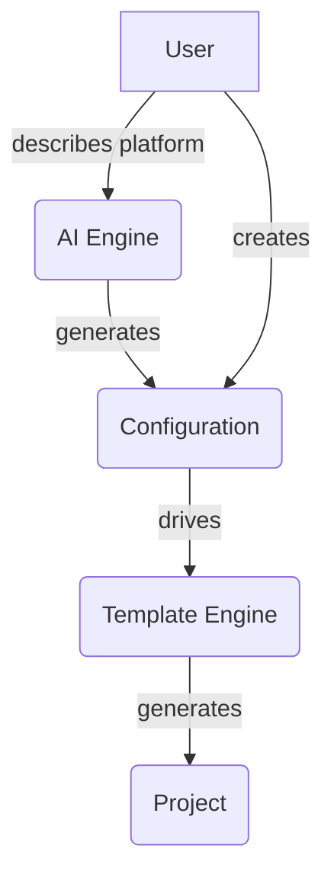

# Architecture

This document provides a high-level overview of the Platform Forge architecture.

## Core Components

Platform Forge is composed of the following core components:

- **CLI:** The command-line interface is the primary way to interact with Platform Forge. It provides commands for
  creating new projects, managing existing projects, and more.
- **Configuration:** Platform Forge uses a declarative configuration file to define the components of your platform and
  their relationships. This file is used to generate the project structure and code.
- **Templates:** Platform Forge uses a template-based approach to generate new projects. Templates are written in a
  simple, declarative language and can be customized to your specific needs.
- **AI Engine (Optional):** Platform Forge can use an optional AI engine to generate the configuration for your platform
  from a natural language description.

## Project Structure

A Platform Forge project is organized into the following directories:

- **`src/`:** Contains the source code for your platform.
- **`docs/`:** Contains the documentation for your platform.
- **`tests/`:** Contains the tests for your platform.
- **`pyproject.toml`:** The project's configuration file.
- **`mkdocs.yml`:** The documentation's configuration file.

## Data Flow

The following diagram illustrates the data flow within Platform Forge:

